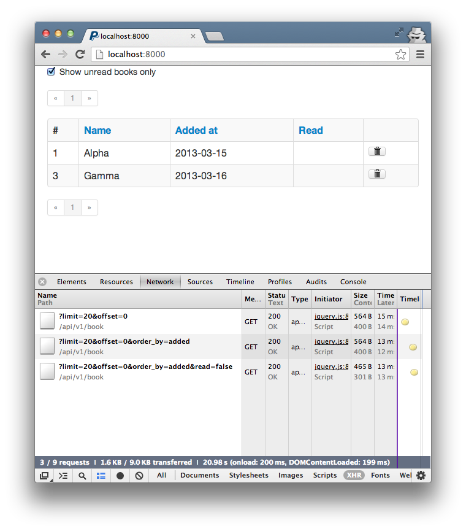

# TastyBackbonePie

Javascript class to create ajax data tables using a [django-tastypie](http://tastypieapi.org/) api backend.

Includes a way to easily:

* [paginate](#paginating)
* [sort](#column-sorting) 
* [filter](#filtering)

tables too.

__Version 0.2.1 alpha - This project is in a very early stage.__



## How to use

You can also take a look at the source of the [django test project](https://github.com/sspross/tastybackbonepie-djangoproject).

### Requirements

Maybe it works with other versions too, but atm it is tested with:

#### Javascript
- jQuery 1.9.1
- underscore.js 1.4.4
- backbone.js 0.9.10

#### Django
- Django 1.5
- Tastypie 0.9.12

### Tastypie example setup

0. Create a Tastypie API ressource in e.g. `api.py` like:

	```python
	from tastypie.resources import ModelResource
	from myapp.models import Book


	class BookResource(ModelResource):
	    class Meta:
	        queryset = Book.objects.all()
	        resource_name = 'book'
	        allowed_methods = ['get']
	        fields = ('id', 'name', 'added', 'read')
	```

0. Add API to your `urls.py` file:

	```python
    from django.conf.urls.defaults import patterns, include
	from tastypie.api import Api
	from myapp.api import BookResource


	v1_api = Api(api_name='v1')
	v1_api.register(BookResource())

	urlpatterns += patterns('',
	    (r'^api/', include(v1_api.urls)),
	)
	```

Now you should be able to access your ressource over your API like `/api/v1/book/?format=json`.

### Basic table

```html
<div id="book-table"></div>

<script type="text/javascript" src="//cdnjs.cloudflare.com/ajax/libs/jquery/1.9.1/jquery.min.js"></script>
<script type="text/javascript" src="//cdnjs.cloudflare.com/ajax/libs/underscore.js/1.4.4/underscore-min.js"></script>
<script type="text/javascript" src="//cdnjs.cloudflare.com/ajax/libs/backbone.js/0.9.10/backbone-min.js"></script>
<script type="text/javascript" src="{{ STATIC_URL }}tastybackbonepie/tastybackbonepie-min.js"></script>
<script type="text/javascript">
    var book_table_settings = {
        uid: 'book_table',
        url: '/api/v1/book/',
        fields: [
            {
                'key': 'id',
                'label': '#',
            },
            {
                'key': 'name',
                'label': 'Name',
            },
            {
                'key': 'added',
                'label': 'Added at',
            },
            {
                'key': 'read',
                'label': 'Read',
            }
        ]
    };

    var book_table = new TastyBackbonePieTable(document.getElementById('book-table'), book_table_settings);
</script>
```

### Template fields

Define `template` on a field. You can use underscore template syntax and the `entry` object to access your field values.

```javascript
var book_table_settings = {
	...
	fields: [
		...
	    {
	        'key': 'read',
	        'label': 'Read',
	        'template': '<% if (entry.get(\'read\') == true) { %>x<% } %>',
	    }
	    ...
	]
```

### Additional HTML fields

Add `additionalHtmlFields` to your settings and add string values cointaining html to it. 
You can use underscore template syntax and the `entry` object to access your field values.

```javascript
var book_table_settings = {
	...
	additionalHtmlFields = [
		'<a class="btn" role="button" href="#" data-id="<%= entry.get(\'id\') %>"><i class="icon-trash"></i></a>',
	]
	...
```

### Paginating

By default the pagination limit is set to 20. At the moment you can overwrite this default like this:

```javascript
Backbone.Tastypie['defaultLimit'] = 10;
```

Set this before creating new TastyBackbonePieTable instances.

You can also easily show or hide the pagination bar at the top or bottom by overwriting `hasPaginationTop` and/or `hasPaginationBottom` in your table settings:

```javascript
var book_table_settings = {
    ...
    hasPaginationTop = false,
    ...
```


### Column sorting

Add order fields in your tastypie `ModelResource` and set `order_by` on your fields.

```python
class BookResource(ModelResource):
    class Meta:
        ...
        ordering = ('name', 'added', 'read')
```

```javascript
var book_table_settings = {
    ...
    fields = [
        ...
        {
            'key': 'name',
            'label': 'Name',
            'order_by': 'name',
        },
        {
            'key': 'added',
            'label': 'Added at',
            'order_by': 'added',
        },
        {
            'key': 'read',
            'label': 'Read',
            'template': '<% if (entry.get(\'read\') == true) { %>x<% } %>',
            'order_by': 'read',
        },
    ]

```

### Filtering

Add filters to your tastypie `ModelResource` and change filter parameters via javascript:

```python
class BookResource(ModelResource):
    class Meta:
    	...
        filtering = {
            'read': ['exact'],
        }
```

```html
<label class="checkbox"><input type="checkbox" id="filter-read"> Show unread books only</label>
<div id="book-table"></div>
...
<script type="text/javascript">
	...
    var book_table = new TastyBackbonePieTable(document.getElementById('book-table'), book_table_settings);

    $('#filter-read').click(function(event){
        if ($(this).is(':checked')) {
            book_table.setParameter('read', 'false'); // you can also use book_table.extendParameters({'read': 'false'});
        } else {
            book_table.removeParameter('read')
        }
        book_table.render();
    });
</script>
```

### Use own templates

Set `tableTemplate`, `paginationTemplate` and/or `errorTemplate` in your settings. Take a look at the [default templates](tastybackbonepie/tastybackbonepie.js).

```javascript
var book_table_settings = {
    ...
    tableTemplate = '...',
    paginationTemplate = '...',
    errorTemplate = '...'
```

### History

- 2013-04-18 Rewritten as plain javascript class, depending on jQuery
- 2013-03-16 Rewritten in javascript as jQuery plugin. 
- 2013-03-15 First version was implemented server side as a Django app, still available [here](../../tree/django-app-implementation), but not further developed.
